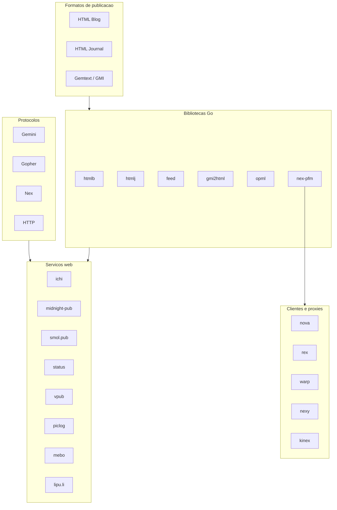
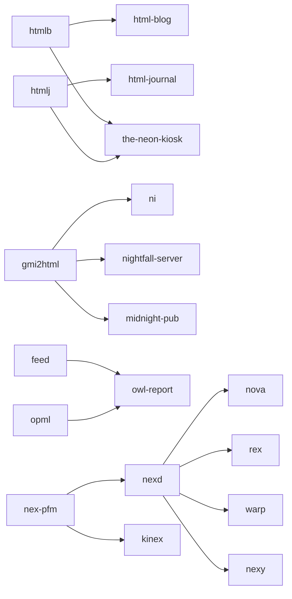

# Ecossistema m15o — Documentação dos Projetos

Documentação dos **38 repositórios** do autor [m15o](https://git.sr.ht/~m15o) clonados neste projeto. Cada projeto tem um arquivo `.md` dedicado nesta pasta com detalhes completos.

## Visão geral

O ecossistema m15o orbita a **"small web"** — uma internet alternativa, minimalista e auto-hospedável, com protocolos como **Gemini**, **Gopher** e **Nex**, formatos de publicação em HTML puro, e ferramentas que privilegiam simplicidade sobre escala.

---

## Índice por categoria

### Comunidades e serviços web (auto-hospedáveis)

| Projeto | Descrição | Doc |
|---------|-----------|-----|
| **ichi** | Comunidade de homepages gratuitas (ichi.city) | [ichi.md](ichi.md) |
| **midnight-pub** | Pub virtual — rede social multi-protocolo | [midnight-pub.md](midnight-pub.md) |
| **smol.pub** | Diário/journal na small web | [smol.pub.md](smol.pub.md) |
| **status** | Microblogging de status curtos (estilo status.cafe) | [status.md](status.md) |
| **vpub** | Fórum hierárquico (fórum → board → tópico → post) | [vpub.md](vpub.md) |
| **riku** | Backend para formulários HTML | [riku.md](riku.md) |
| **owl-report** | Leitor de feeds RSS/Atom self-hosted | [owl-report.md](owl-report.md) |
| **piclog** | Compartilhamento de fotos JPEG | [piclog.md](piclog.md) |
| **mebo** | Fórum/message board em PHP | [mebo.md](mebo.md) |
| **lipu.li** | Wiki leve multi-usuário | [lipu.li.md](lipu.li.md) |

### Formatos HTML e validação

| Projeto | Descrição | Doc |
|---------|-----------|-----|
| **html-blog** | Define e valida o formato HTML Blog | [html-blog.md](html-blog.md) |
| **html-journal** | Define e valida o formato HTML Journal | [html-journal.md](html-journal.md) |
| **htmlb** | Parser de HTML Blog (biblioteca Go) | [htmlb.md](htmlb.md) |
| **htmlj** | Parser de HTML Journal (biblioteca Go) | [htmlj.md](htmlj.md) |
| **the-neon-kiosk** | Agregador de journals e blogs HTML | [the-neon-kiosk.md](the-neon-kiosk.md) |

### Protocolo Nex (Nightfall City)

| Projeto | Descrição | Doc |
|---------|-----------|-----|
| **nex-pfm** | Biblioteca do protocolo Nex | [nex-pfm.md](nex-pfm.md) |
| **nexd** | Daemon TCP Nex (porta 1900) | [nexd.md](nexd.md) |
| **kinex** | Gateway HTTP Nex → HTML | [kinex.md](kinex.md) |
| **nexy** | Proxy Nex → Gemini | [nexy.md](nexy.md) |
| **nova** | Navegador gráfico Nex (Lazarus) | [nova.md](nova.md) |
| **rex** | Navegador Nex de terminal (shell) | [rex.md](rex.md) |
| **warp** | Navegador Nex no browser (PHP) | [warp.md](warp.md) |
| **nightfall-server** | Servidor Gemini/HTTP de nightfall.city | [nightfall-server.md](nightfall-server.md) |

### Wikis e geradores estáticos

| Projeto | Descrição | Doc |
|---------|-----------|-----|
| **ni** | Wiki estática a partir de gemtext | [ni.md](ni.md) |
| **nini** | Wiki estática a partir de HTML | [nini.md](nini.md) |
| **ichipedia** | Enciclopédia estática da small web | [ichipedia.md](ichipedia.md) |
| **moka** | Wiki client-side (um arquivo HTML) | [moka.md](moka.md) |
| **yon** | Editor de notas/wiki client-side | [yon.md](yon.md) |

### Bibliotecas Go

| Projeto | Descrição | Doc |
|---------|-----------|-----|
| **feed** | Parser RSS e Atom | [feed.md](feed.md) |
| **gmi2html** | Conversor gemtext → HTML | [gmi2html.md](gmi2html.md) |
| **opml** | Parser de listas OPML | [opml.md](opml.md) |

### Editores, linguagens e experimentos

| Projeto | Descrição | Doc |
|---------|-----------|-----|
| **15f** | Linguagem Forth-like com gráficos SDL2 | [15f.md](15f.md) |
| **bitters** | Editor inspirado no Canon Cat | [bitters.md](bitters.md) |
| **grid** | Editor inspirado no ACME (Gridscript) | [grid.md](grid.md) |
| **nspace** | Linguagem para máquinas de registradores | [nspace.md](nspace.md) |
| **tny** | Máquina virtual de 256 bytes com emulador | [tny.md](tny.md) |

### Configuração pessoal

| Projeto | Descrição | Doc |
|---------|-----------|-----|
| **dotfiles** | Configurações X11/FVWM e scripts | [dotfiles.md](dotfiles.md) |
| **emacs.d** | Configuração Emacs para o ecossistema m15o | [emacs.d.md](emacs.d.md) |

---

## Resumo de cada projeto

### 15f
Interpretador Forth-like com renderização gráfica SDL2. Scripts `.15f` desenham na tela usando pilha e primitivas visuais.

### bitters
Editor de texto inspirado no Canon Cat (Jef Raskin), com navegação "leap" e modos de composição alternativos.

### dotfiles
Configurações pessoais de desktop Unix/X11: FVWM, sessão X, remapeamento de teclas e scripts de monitor externo.

### emacs.d
Emacs configurado para editar conteúdo da small web: modos para HTML Blog, gemtext, journals e cliente Gopher.

### feed
Biblioteca Go que parseia feeds RSS e Atom numa estrutura unificada. Usada pelo owl-report.

### gmi2html
Biblioteca Go que converte gemtext (`.gmi`) em HTML. Base de vários projetos do ecossistema.

### grid
Editor estilo ACME escrito em Gridscript (Forth-like) com engine C e SDL2.

### html-blog
Servidor que define o formato HTML Blog, valida páginas e converte para Atom. Referência: blog.miso.town.

### html-journal
Servidor que define o formato HTML Journal, valida e converte para Atom. Referência: journal.miso.town.

### htmlb
Parser Go de páginas HTML Blog — extrai título, datas e links das entradas.

### htmlj
Parser Go de páginas HTML Journal — extrai título, artigos e datas.

### ichi
Comunidade onde pessoas criam homepages gratuitas com subdomínio, editor web e SFTP. Roda em ichi.city.

### ichipedia
Wiki estática enciclopédica sobre a small web, escrita em gemtext.

### kinex
Servidor HTTP que expõe estações Nex na web, convertendo conteúdo para HTML.

### lipu.li
Motor de wiki PHP leve com links `[[slug]]`, backlinks e feed Atom.

### mebo
Fórum PHP simples com threads, respostas aninhadas e moderação.

### midnight-pub
Pub virtual — rede social com posts, wiki pessoal e suporte a HTTP, Gemini e Gopher.

### moka
Wiki/editor num único HTML, client-side, com localStorage e export.

### nex-pfm
Biblioteca Go do protocolo Nex — listagem de diretórios e serving de arquivos.

### nexd
Daemon TCP que serve o protocolo Nex na porta 1900.

### nexy
Proxy que expõe conteúdo Nex via Gemini (porta 1965).

### ni
Gerador de wiki estática a partir de arquivos gemtext, com backlinks.

### nightfall-server
Servidor de nightfall.city: Gemini + HTTP com conversão gmi2html e TLS automático.

### nini
Gerador de wiki estática a partir de HTML (`.htm`), com backlinks — "a nova ni".

### nova
Navegador gráfico desktop para Nex, escrito em Lazarus/Pascal.

### nspace
Linguagem e interpretador para máquinas de registradores.

### opml
Biblioteca Go para parsear listas de assinaturas OPML.

### owl-report
Leitor de feeds self-hosted com import OPML e relatório HTML agregado.

### piclog
Plataforma de upload e compartilhamento de fotos JPEG com perfis e feed RSS.

### rex
Navegador Nex minimalista de terminal (~10 linhas de shell).

### riku
Backend para coletar respostas de formulários HTML com inbox e feed Atom.

### smol.pub
Serviço de journal multi-protocolo (Web, Gemini, Gopher) com temas e TLS.

### status
Microblogging de status curtos com menções, feeds Atom, API JSON e widgets.

### the-neon-kiosk
Agregador estático de HTML Journals e Blogs recentes. Roda em kiosk.nightfall.city.

### tny
Máquina virtual de 256 bytes com emulador gráfico SDL2 e assembler próprio.

### vpub
Fórum auto-hospedável com hierarquia fórum/board/tópico/post e feeds Atom.

### warp
Navegador Nex no browser — traduz protocolo Nex para HTML via PHP.

### yon
Wiki/editor de notas client-side com multi-painel, busca e export quine.

---

## Relações entre projetos

---

## Estatísticas

| Métrica | Valor |
|---------|-------|
| Total de projetos documentados | 38 |
| Repositórios Git | 27 |
| Repositórios Mercurial | 11 |
| Linguagem predominante (serviços) | Go |
| Linguagem predominante (apps PHP) | PHP + MySQL |

---

## Links úteis

- Perfil Git: https://git.sr.ht/~m15o
- Perfil Mercurial: https://hg.sr.ht/~m15o
- Lista de repositórios: [links_srht_m15o.txt](../links_srht_m15o.txt)
- Script de clonagem: [clone-repos.ps1](../clone-repos.ps1) / [clone-repos.sh](../clone-repos.sh)
